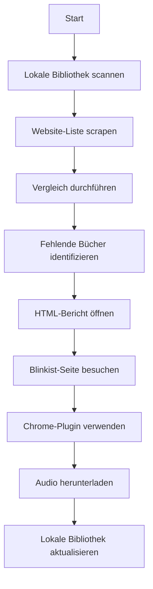

# Blinkist Downloader

Ein umfassendes Toolset zur Analyse und zum Download von Blinkist-Audioinhalten. Dieses Projekt besteht aus zwei Hauptteilen: einer Python-basierten Scan-Anwendung zur Analyse Ihrer lokalen Blinkist-Bibliothek und einem Chrome-Browser-Plugin zum direkten Download von Audio-Dateien von der Blinkist-Website.

## Was ist Blinkist?

Blinkist ist eine Plattform, die Bücher in kurze, prägnante Zusammenfassungen (sogenannte "Blasts") komprimiert. Diese Blasts sind als Audio- oder Textversionen verfügbar und ermöglichen es Nutzern, das Wesentliche eines Buches in 15 Minuten aufzunehmen. Blinkist bietet eine breite Palette von Büchern zu Themen wie Produktivität, Psychologie, Wirtschaft und mehr. Die Audio-Versionen sind besonders beliebt für unterwegs.

Dieses Tool hilft Ihnen dabei, Ihre lokale Sammlung von Blinkist-Audio-Dateien zu verwalten, fehlende Inhalte zu identifizieren und neue Dateien direkt von der Website herunterzuladen.

## Features

### Scan-Anwendung (Python-Skripte)
- **Vollständige Bibliotheksanalyse**: Durchsucht Ihre lokale Blinkist-Sammlung und erstellt eine detaillierte Übersicht aller vorhandenen Dateien.
- **Website-Abgleich**: Vergleicht Ihre lokale Bibliothek mit dem aktuellen Angebot auf Blinkist.com, um fehlende Bücher zu identifizieren.
- **Automatische Berichterstellung**: Generiert CSV-Dateien und HTML-Berichte mit direkten Download-Links für fehlende Inhalte.
- **Intelligente Übereinstimmung**: Verwendet Fuzzy-Matching und Slug-basierte Vergleiche, um Dateien korrekt zuzuordnen.
- **Bildersuche**: Fügt automatisch Cover-Bilder zu Ihren Audio-Dateien hinzu, falls diese fehlen.
- **Flexible Konfiguration**: Unterstützt verschiedene Verzeichnisstrukturen und Dateiformate.

### Chrome-Browser-Plugin
- **Blob-Extraktion**: Erkennt automatisch Audio-Blob-URLs auf Blinkist-Seiten.
- **Direkter Download**: Ermöglicht den sofortigen Download von Audio-Dateien mit korrekten Dateinamen.
- **Intelligente Dateibenennung**: Formatiert Dateinamen basierend auf dem Seitentitel (z.B. "Autor - Titel.mp3").
- **Unterstützte Formate**: Erkennt und speichert in MP3, M4A, WebM, OGG und WAV.
- **Einfache Bedienung**: Popup-Interface zum Auswählen und Herunterladen von Audio-Inhalten.

## Installation

### Voraussetzungen

#### Für die Scan-Anwendung:
- Python 3.8 oder höher
- Erforderliche Python-Pakete:
  - pandas
  - beautifulsoup4
  - requests
  - rapidfuzz (optional, für bessere Fuzzy-Matching)

#### Für das Chrome-Plugin:
- Google Chrome oder Chromium-basierter Browser
- Entwicklermodus aktiviert

### Setup der Scan-Anwendung

1. **Repository klonen**:
   ```bash
   git clone https://github.com/ErhardRainer/blinkist_downloader.git
   cd blinkist_downloader
   ```

2. **Virtuelle Umgebung erstellen** (empfohlen):
   ```bash
   python -m venv venv
   venv\Scripts\activate  # Windows
   # oder
   source venv/bin/activate  # Linux/Mac
   ```

3. **Abhängigkeiten installieren**:
   ```bash
   pip install pandas beautifulsoup4 requests rapidfuzz
   ```

4. **Konfiguration**: Bearbeiten Sie die Hardcoded-Pfade in den Skripten nach Bedarf (z.B. den Pfad zu Ihrer lokalen Blinkist-Bibliothek).

### Setup des Chrome-Plugins

1. **Plugin laden**:
   - Öffnen Sie Chrome und gehen Sie zu `chrome://extensions/`
   - Aktivieren Sie den "Entwicklermodus" (oben rechts)
   - Klicken Sie auf "Entpackte Erweiterung laden"
   - Wählen Sie den `Chrome_Plugin`-Ordner aus diesem Repository

2. **Berechtigungen**: Das Plugin benötigt Zugriff auf aktive Tabs und Scripting-Berechtigungen für Blinkist-Seiten.

## Verwendung

### Scan-Anwendung

Die Scan-Anwendung besteht aus mehreren Python-Skripten im `python/`-Verzeichnis. Sie können einzeln oder über das Hauptvergleichsskript ausgeführt werden.

#### 1. Website-Liste scrapen (`site_booklist_scraper.py`)
Extrahiert alle verfügbaren Bücher von einer lokalen Kopie der Blinkist-Sitemap.

```bash
cd python
python site_booklist_scraper.py
```

**Ausgabe**: `site_booklist.csv` mit Spalten 'Buch' (Titel) und 'Link' (URL).

#### 2. Lokale Bibliothek scannen (`scan_blinkist_library.py`)
Durchsucht ein Verzeichnis nach Blinkist-Dateien und erstellt eine CSV mit Metadaten.

```bash
python scan_blinkist_library.py --input "C:\Pfad\zu\Ihrer\Blinkist\Bibliothek" --output local_blinkist_files.csv --include-content
```

**Parameter**:
- `--input`: Pfad zum zu scannenden Verzeichnis
- `--output`: Ausgabedatei für die CSV
- `--include-content`: Textinhalt der Dateien einbeziehen (vergrößert die Datei)
- `--max-content-bytes`: Maximale Bytes für Inhaltslesung (Standard: 1MB)

#### 3. Vergleich durchführen (`compare_blinkist_site_and_library.py`)
Vergleicht die Website-Liste mit Ihrer lokalen Bibliothek und identifiziert fehlende Bücher.

```bash
python compare_blinkist_site_and_library.py
```

**Ausgaben**:
- `blinkist_existing_books_comparison.csv`: Detaillierter Vergleich
- `blinkist_missing_books.html`: HTML-Seite mit Download-Links für fehlende Bücher
- `blinkist_missing_books.json`: JSON-Datei mit strukturierten Daten

#### 4. Bilder suchen (`search_book_image.py`)
Fügt Cover-Bilder zu Audio-Dateien hinzu.

**Konfiguration erforderlich**: Setzen Sie `GOOGLE_API_KEY` und `SEARCH_ENGINE_ID` als Umgebungsvariablen oder direkt im Skript.

```bash
python search_book_image.py
```

### Chrome-Plugin

1. **Auf Blinkist navigieren**: Gehen Sie zu einer Blinkist-Buchseite mit Audio-Inhalt.
2. **Plugin öffnen**: Klicken Sie auf das Plugin-Icon in der Chrome-Toolbar.
3. **Audio auswählen**: Das Plugin zeigt gefundene Audio-Blobs an. Klicken Sie auf einen Eintrag, um ihn herunterzuladen.
4. **Download**: Die Datei wird automatisch mit einem sinnvollen Namen gespeichert.

**Unterstützte Seiten**: Funktioniert auf allen Blinkist-Seiten mit Audio-Elementen.

## Workflow-Beispiel



## Konfiguration

### Umgebungsvariablen für Bildersuche
```bash
export GOOGLE_API_KEY="Ihr_Google_API_Key"
export SEARCH_ENGINE_ID="Ihre_Custom_Search_Engine_ID"
```

### Pfad-Anpassungen
Bearbeiten Sie die Hardcoded-Pfade in `compare_blinkist_site_and_library.py`:
- `default_blinkist_dir`: Pfad zu Ihrer lokalen Blinkist-Bibliothek
- `booklinks_path`: Pfad zur Website-Liste CSV
- `files_csv_path`: Pfad zur lokalen Dateien CSV

## Fehlerbehebung

### Häufige Probleme

1. **Keine Audio-Blobs gefunden**: Stellen Sie sicher, dass die Blinkist-Seite vollständig geladen ist und Audio-Inhalte verfügbar sind.

2. **Download fehlgeschlagen**: Überprüfen Sie Browser-Berechtigungen und stellen Sie sicher, dass Popups nicht blockiert werden.

3. **Skripte finden keine Dateien**: Überprüfen Sie die Pfadangaben und Berechtigungen für das Scan-Verzeichnis.

4. **Abhängigkeiten fehlen**: Installieren Sie alle erforderlichen Python-Pakete mit `pip install -r requirements.txt` (falls vorhanden).

### Logs und Debugging
- Die Python-Skripte geben detaillierte Ausgaben in der Konsole aus.
- Für das Chrome-Plugin: Öffnen Sie die Entwicklertools (F12) und prüfen Sie die Konsole auf Fehler.

## Beiträge

Beiträge sind willkommen! Bitte erstellen Sie Issues für Fehlerberichte oder Feature-Anfragen und Pull Requests für Code-Änderungen.

## Lizenz

Dieses Projekt ist unter der MIT-Lizenz lizenziert. Siehe [LICENSE](LICENSE) für Details.

## Haftungsausschluss

Dieses Tool ist für persönliche, nicht-kommerzielle Nutzung gedacht. Stellen Sie sicher, dass Sie die Nutzungsbedingungen von Blinkist einhalten und keine urheberrechtlich geschützten Inhalte unrechtmäßig herunterladen.